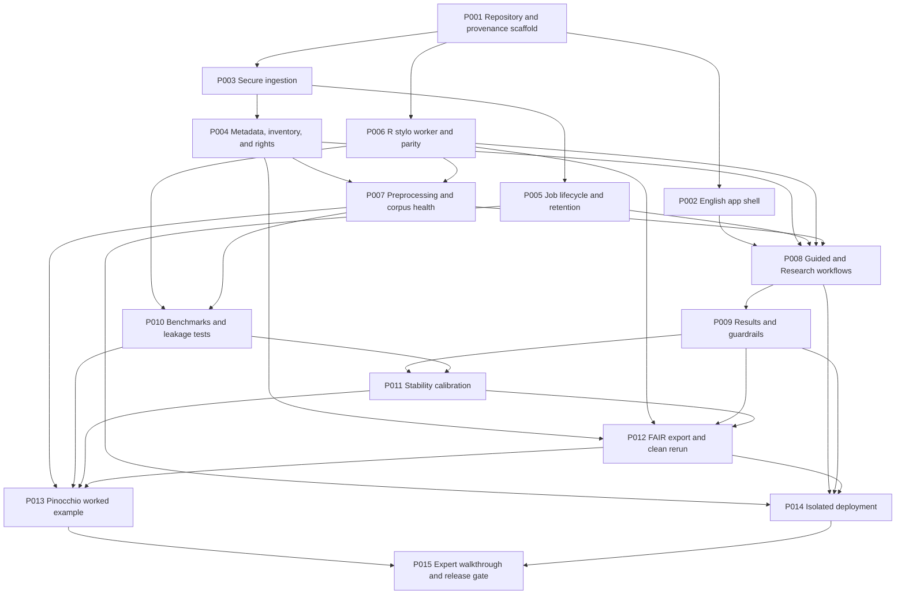

# Delta P001-P015 Development Roadmap

**Durum:** P000'da dondurulmuş uygulama planı  
**Tarih:** 2026-07-10  
**Uygulama sahibi:** Oğuz Koran  
**Birincil geliştirme ajanı:** Ticket başında seçilen Codex veya Claude Code  
**Bağımsız uzman denetimi:** Barış Yücesan, yalnız P015'te tanımlanan kapsamda  
**Hedef:** v0.1 public beta, FAIR-oriented release ve Umanistica Digitale makale kanıt paketi

## 1. Bu Yol Haritası Nasıl Kullanılır?

Her P-ticket tek bir denetlenebilir geliştirme birimidir. Ticket tamamlanmış sayılmak için kodun çalışması yetmez. Aşağıdakilerin tamamı gerekir:

1. Tanımlı deliverable'lar üretilir.
2. Acceptance testleri gerçek ortamda çalıştırılır.
3. Test komutları, sürümler, sonuçlar ve artifact yolları ticket kaydına yazılır.
4. İlgili claim-evidence ve threat kayıtları güncellenir.
5. `SESSION_HANDOFF.md` sıradaki tek işe geçirilir.
6. Kullanıcıya ait veya ajan tarafından yapılmamış değişiklikler geri alınmaz.

Bir acceptance testi geçmiyorsa ticket `complete` olmaz. Kısmi sonuç `blocked` veya `in progress` olarak kaydedilir. Bir ticket'ın non-goal listesindeki özellik, kolay görünse bile aynı ticket'a eklenmez.

## 2. Global Definition of Done

Her ticket için ortak bitiş koşulları:

- Yeni davranış için otomatik test vardır.
- Hata yolu ve sınır koşulu en az bir fixture ile sınanır.
- Kullanıcıya gösterilen İngilizce metin kesinlik, confidence, pure style, causality veya genel usability iddiası üretmez.
- Yeni dependency lockfile'a girer ve gerekçesi ticket'ta yer alır.
- Ham kullanıcı metni log, test snapshot'ı veya Git history'ye girmez.
- Yeni metadata, result veya export yapısı sürümlü şemaya bağlıdır.
- Güvenlik etkisi varsa `docs/security/threat-model.md` güncellenir.
- Bilimsel iddia etkisi varsa `docs/research/claim-evidence-matrix.md` güncellenir.
- Ticket kaydı human decision owner, AI assistance, acceptance owner ve karar gerekçesini birbirinden ayırır.
- Kod, test ve belge aynı ticket kimliğini taşır.
- Commit mesajı `P0XX: short description` biçimindedir.

## 3. Bağımlılık Haritası

**Bilimsel kritik yol:** P001, P003, P004, P007, P010, P011, P012, P013, P015.  
**Operasyon kritik yolu:** P001, P003, P005, P008, P014, P015.  
**Paralel çalışma:** P002 ve P006, P001 sonrasında ayrı dallarda ilerleyebilir. P013 hak denetimi, corpus metni analize alınmadan önce P004 şemasıyla erkenden başlatılabilir.

## 4. Ticket Sözleşmeleri

### P001: Repository, Locks, Metadata, and Provenance Scaffold

**Durum:** Tamamlandı; acceptance raporu `provenance/evidence/P001/report.md`.

**Amaç:** Delta'yı bağımsız, taşınabilir, iki ajanla sürdürülebilir ve ilk commit'ten itibaren denetlenebilir bir yazılım projesi haline getirmek.

**Bağımlılık:** P000 kapanışı.

**Deliverable'lar:**

- Repo topolojisini karara bağlayan ADR-0009. Tercih edilen yön, Delta için ayrı public Git repository; mevcut akademik asistan çalışma ağacının kullanıcı değişikliklerine dokunulmaz.
- Python ve R sürüm politikası; Python lockfile ve `renv.lock`; pinlenmiş container tabanı.
- Minimal paket yapısı, test dizini, fixture politikası, format/lint/type/test komutları.
- `VERSION`, `LICENSE`, `CITATION.cff`, `codemeta.json`, `.gitignore`, `.env.example` ve başlangıç README'si.
- Versioned JSON Schemas: `PromptEvent`, `Ticket`, `HumanDecision`, `Run`, `AssetRights` ve `ReleaseManifest`.
- `provenance/prompt-events.jsonl`, `provenance/tickets`, `provenance/runs`, `provenance/evidence` ve redaction kayıtları için dizin/araç yapısı.
- `human-decision-ledger.jsonl`: karar sahibi, AI önerisi, kabul/red, gerekçe, acceptance sahibi ve ilişkili kimlikler.
- CI iskeleti, secret scan, dependency scan ve SBOM üretim komutu.

**Acceptance kapısı:**

- Temiz bir checkout'ta tek belgelenmiş komut Python ve R ortamını kurar.
- Format, lint, type check, unit test ve schema validation sıfır hata verir.
- Lockfile değiştirilmeden iki kurulum aynı doğrudan dependency sürümlerini üretir.
- Örnek PromptEvent hash doğrulaması geçer; `native`, `reconstructed` ve `summary-only` modları karışmaz.
- Örnek HumanDecision kaydı şemayı geçer; AI önerisi insan kararı veya acceptance sonucu gibi gösterilemez.
- Repository içine secret, gerçek kullanıcı metni veya macOS absolute path girmediği taramayla gösterilir.

**Kanıt:** `provenance/evidence/P001/` altında environment, lock, schema, SBOM ve scan raporları.  
**Claim/tehdit bağlantısı:** CE-12, CE-18, CE-19, CE-20; SEC-16, RP-08, RP-09.  
**Non-goal:** İşlevsel analiz ekranı, production deployment, Pinokyo corpus'u.  
**Sahip/denetçi:** Codex veya Claude uygular; Oğuz repo ve lisans kararını onaylar.

### P002: English-Only Workbench Shell

**Durum:** 2026-07-10 tarihinde tamamlandı. Implementation snapshot:
`a888e7c81e5fdae12687903de29d0728f5c7cbd5`. Acceptance ve clean-clone kanıtı:
`provenance/evidence/P002/` ve `provenance/runs/RUN-20260710-0004.json`.
P003'ten önce ayrı branch üzerinde bağımsız Claude audit-and-repair ve son Codex
denetimi uygulandı; bu review eski evidence'i overwrite etmedi.

**Amaç:** Pazarlama landing page'i yerine doğrudan kullanılabilir, erişilebilir ve ileride yerelleştirilebilir iş istasyonu kabuğu kurmak.

**Bağımlılık:** P001.

**Deliverable'lar:**

- Streamlit uygulama giriş noktası ve workbench navigasyonu.
- İlk ekranda üç amaç: Text Proximity, Group Comparison, Style Over Time.
- Guided ve Research mode ayrımı; henüz çalışmayan kontroller açıkça disabled.
- İngilizce UI string registry; kod içine dağılmış kullanıcı metni yok. Türkçe ve İtalyanca çeviri eklenmez.
- Error, empty, loading, cancel ve complete durumları için ortak component sözleşmesi.
- Health/readiness kontrolü; sürüm ve build kimliği görünür fakat sistem yolu ve secret görünmez.
- Runtime AI, analytics, login ve permanent storage içermediğine ilişkin config/dependency denetimi.

**Acceptance kapısı:**

- Desktop ve mobile Playwright smoke testleri geçer; metin taşması ve incoherent overlap yoktur.
- Klavye ile ana akışa ulaşılır; form label ve hata mesajları erişilebilir adla bağlıdır.
- Ekranda `confidence`, `find the author`, `easy for everyone`, `no knowledge needed` veya yasaklı claim yoktur. Sınırlandırılmış `no prior R or Python coding required for supported workflows` ifadesine izin verilir.
- Ağ kapalıyken shell açılır; harici AI/analytics endpoint isteği oluşmaz.

**Kanıt:** UI screenshot seti, accessibility raporu, network trace ve copy snapshot.  
**Claim/tehdit bağlantısı:** CE-01, CE-18, CE-20; SEC-14, EPI-13.  
**Non-goal:** Görselleştirmelerin hesaplanması, kullanıcı hesabı, çok dilli UI.  
**Sahip/denetçi:** Geliştirme ajanı uygular; Oğuz İngilizce ürün dilini onaylar.

### P003: Secure Ingestion

**Durum:** 2026-07-11 tarihinde tamamlandı. Otomatik, adversarial, exact-commit clean-clone ve Oğuz'un manuel browser kabul kapıları geçti.

**Amaç:** `.txt`, `.zip` ve metadata `.csv` girdilerini çalışma alanı dışına taşmadan ve sunucuyu tüketmeden kabul etmek.

**Bağımlılık:** P001.

**Deliverable'lar:**

- Açık rol, uzantı, varsa MIME ve rol parser'ıyla tür kontrolü; UTF-8 ve Unicode NFC doğrulaması.
- Archive üyelerini extraction öncesi denetleyen güvenli extractor.
- Boyut, üye sayısı, sıkıştırma oranı, path, nesting, token ve satır limitleri.
- Sunucu üretimli asset kimliği; kullanıcı dosya adı yalnız escaped display label olur.
- CSV formula, HTML, newline, path ve log injection savunmaları.
- Güvenli hata kodları ve reddedilen upload'un hiçbir analiz state'i oluşturmaması.

**Acceptance kapısı:**

- Zip-slip, symlink, hardlink, absolute path, nested archive ve zip-bomb fixture'larının tamamı fail-closed reddedilir.
- Bozuk encoding, binary/polyglot ve duplicate filename sonuçları deterministiktir.
- Fuzz test belirlenen çalışma süresinde crash veya workspace escape üretmez.
- Rejected upload sonrasında temp dizin, log ve session state içinde payload kalmaz.

**Kanıt:** `provenance/evidence/P003/` altında malicious fixture inventory, parser raporu, fuzz özeti, cleanup taraması, browser audit, başarısız run'lar, path errata ve clean-clone raporu; `RUN-20260711-0003` ve `provenance/evidence/P003.sha256`. Ayrı insan kabul paketi `RUN-20260711-0004`, nihai `HD-20260711-0008`, kapsamı açıklanan kabul bağlamı ve `provenance/evidence/P003-human-acceptance.sha256` ile kayıtlıdır.
**Claim/tehdit bağlantısı:** CE-14; SEC-01, SEC-02, SEC-03, SEC-04, SEC-05.  
**Non-goal:** PDF, DOCX, EPUB, OCR veya TEI ingestion.  
**Sahip/denetçi:** Geliştirme ajanı uygular; P014'te bağımsız deployment testi tekrarlanır.

### P004: Metadata, Corpus Inventory, and Rights

**Amaç:** Her metni bilimsel bir eser ve ayrı bir hak varlığı olarak tanımlayan doğrulanabilir corpus modeli kurmak.

**Bağımlılık:** P003.

**Deliverable'lar:**

- Genel asset metadata şeması ve Style Over Time için zorunlu kronoloji alanları.
- `author`, `work_id`, edition, genre, audience, adaptation, collection, source ve normalization ilişkileri.
- Asset-level rights state machine: `verified-open`, `analysis-only`, `permission-required`, `unknown`, `excluded`.
- Upload izni, analiz izni, export izni ve public redistribution iznini ayrı alanlarda tutan model.
- CSV template, field dictionary, örnek valid/invalid corpus ve kullanıcıya düzeltilebilir validation raporu.
- Corpus inventory hash'i ve metadata değişikliği sonrası run invalidation kuralı.

**Acceptance kapısı:**

- Şema eksik zorunlu alanı, duplicate `work_id`, çelişkili tarih ve bilinmeyen hak durumunu sessizce kabul etmez.
- `unknown` veya `permission-required` asset raw public export'a giremez.
- Aynı dosyanın farklı sıralamayla yüklenmesi aynı canonical inventory hash'ini üretir.
- Style Over Time, üç kronolojik nokta ve altı bağımsız eser koşulunu karşılamıyorsa exploratory etiketini zorunlu kılar.

**Kanıt:** Schema validation matrisi, rights fixtures ve inventory determinism raporu.  
**Claim/tehdit bağlantısı:** CE-09, CE-13; RP-01, RP-02, EPI-01, EPI-07.  
**Non-goal:** Otomatik telif hukuku kararı veya internetten corpus toplama.  
**Sahip/denetçi:** Geliştirme ajanı uygular; Oğuz hak ve metadata terminolojisini denetler.

### P005: Job Lifecycle, Isolation, and Retention

**Amaç:** Her analizi sınırlandırılmış, iptal edilebilir ve süre sonunda iz bırakmadan temizlenen bir job olarak çalıştırmak.

**Bağımlılık:** P003.

**Deliverable'lar:**

- Kriptografik job kimliği ve server-side session ownership.
- Koşuma özel input, work, result ve export dizinleri.
- Bir çalışan ve en fazla üç bekleyen R job queue politikası.
- CPU, RAM, PID, timeout ve cancellation sözleşmesi; process-tree kill.
- Başarı, hata, kullanıcı iptali, worker crash ve uygulama restart'ı için lifecycle state machine.
- Başarıda export sonrası raw/normalized silme; hatada en çok 15 dakika; disk export'ta en çok 1 saat; content-free loglarda 7 gün.
- Startup janitor ve orphan workspace taraması.

**Acceptance kapısı:**

- İki eşzamanlı session birbirinin job, result veya export'una erişemez.
- Timeout, cancellation, OOM simülasyonu ve restart sonrasında child process ve corpus artığı kalmaz.
- Queue limiti aşıldığında yeni iş fail-safe reddedilir ve kaynak ayırmaz.
- Canary metin, log ve başka session export'unda bulunmaz.

**Kanıt:** Concurrency, crash cleanup, retention ve canary raporları.  
**Claim/tehdit bağlantısı:** CE-14, CE-15; SEC-07, SEC-09, SEC-11, SEC-12, SEC-13.  
**Non-goal:** Dağıtık queue, kullanıcı geçmişi veya kalıcı proje depolama.  
**Sahip/denetçi:** Geliştirme ajanı uygular; P014'te server koşullarıyla yeniden doğrulanır.

### P006: R `stylo` Worker and Computational Parity

**Amaç:** Kanonik hesaplamayı güvenli, sürümlü ve doğrudan `stylo` referansıyla karşılaştırılabilir R worker içinde çalıştırmak.

**Bağımlılık:** P001.

**Deliverable'lar:**

- Sabit R entrypoint ve versioned input/output JSON schema.
- Shell interpolation içermeyen Python worker adapter.
- Classic Burrows Delta ana motoru; Eder's Delta ve Cosine Delta yalnız sensitivity distance olarak.
- Unknown hariç fitting sırası; MFW, culling, scaling ve feature inventory çıktısı.
- Finite-number, matrix symmetry, label cardinality ve partial-failure doğrulaması.
- Küçük açık fixture corpus'ları ve doğrudan `stylo` referans koşumları.

**Acceptance kapısı:**

- Referans fixture'larda distance matrix ve sıralamalar önceden ilan edilmiş sayısal tolerans içinde doğrudan `stylo` koşumuyla eşleşir.
- Unknown metin MFW, culling, mean veya standard deviation hesabına giremez; leakage canary testi geçer.
- Command injection payload'u kod veya shell çalıştıramaz.
- Timeout ve malformed output başarı gibi dönmez.
- R session info, package versions, locale ve seed run kaydında bulunur.

**Kanıt:** Parity matrix, leakage test, wrapper security audit ve session info.  
**Claim/tehdit bağlantısı:** CE-04, CE-07; SEC-06, SEC-07, SEC-08, RP-05, EPI-03.  
**Non-goal:** Yeni Delta formülü veya `stylo` yerine özel istatistik motoru.  
**Sahip/denetçi:** Geliştirme ajanı uygular; metodoloji sonucu Oğuz tarafından incelenir.

### P007: Preprocessing and Corpus Health

**Amaç:** Analizden önce corpus'un neye dönüştürüldüğünü, hangi riskleri taşıdığını ve analizin durması gerekip gerekmediğini görünür kılmak.

**Bağımlılık:** P004, P006.

**Deliverable'lar:**

- Kanonik preprocessing: UTF-8, NFC, lowercase, punctuation/number removal, stopword off, lemmatization off.
- `custom_exclusions.txt` yalnız feature adaylarını etkiler; metin içeriğini silmez.
- Raw ve normalized SHA-256; normalization summary ve token counts.
- Exact ve near-duplicate, shared passage, edition, paratext ve corpus imbalance kontrolleri.
- Blocker, strong warning ve note severity düzeyleri.
- Genre, audience, chronology, adaptation, edition, OCR ve length confound matrisi.
- Minimum veri ve feature kapıları; sessiz parameter downgrade yok.

**Acceptance kapısı:**

- Aynı input ve config aynı normalized hash ve feature inventory üretir.
- Duplicate/near-duplicate fixtures yakalanır; aynı eserin segmentleri bağımsız work olarak sayılmaz.
- 1000 MFW mümkün değilse hücre `not enough features` olur; başka değere çevrilmez.
- Blocker bulunan corpus analiz başlatamaz; kullanıcı risk kaydını export edebilir.

**Kanıt:** Preprocessing golden fixtures, corpus-health matrix ve determinism raporu.  
**Claim/tehdit bağlantısı:** CE-02, CE-09; EPI-01, EPI-02, EPI-04, EPI-06, EPI-07, EPI-11.  
**Non-goal:** OCR düzeltme, lemmatization veya otomatik paratext silme.  
**Sahip/denetçi:** Geliştirme ajanı uygular; Oğuz corpus uyarı dilini onaylar.

### P008: Guided and Research Workflows

**Amaç:** Üç araştırma amacını R/Python kodu yazdırmadan, yöntemsel seçimleri saklamadan uçtan uca çalıştırmak.

**Bağımlılık:** P002, P004, P005, P006, P007.

**Deliverable'lar:**

- Text Proximity, Group Comparison ve Style Over Time wizard akışları.
- Guided Mode: 100, 300, 500, 1000 MFW; 500 MFW, yüzde 0 culling, whole text, Classic Delta anchor.
- Research Mode: sürümlü ve hashlenmiş en çok 24-cell `research-grid-v1` preset.
- Unknown/blind holdout ayrımı ve `analysis_scope` etiketi.
- Whole text ve izin verilen segment boyutları; work-aware fold ve aggregation.
- Review-before-run ekranı; resolved config ve tahmini kaynak yükü.
- Cancel, retry ve partial-cell failure davranışı.

**Acceptance kapısı:**

- Her üç amaç upload'dan run completion'a browser E2E ile kullanıcı kodu veya shell gerektirmeden tamamlanır.
- Anchor sabittir ve “best setting” diye sunulmaz.
- Public job 24 hücreyi geçemez; preset hash'i run kaydına yazılır.
- All-known analiz `transductive_exploratory`; unknown koşumu leakage-free scope ile etiketlenir.
- Segmentler farklı validation fold'larına dağılmaz.

**Kanıt:** Üç E2E raporu, resolved configs, preset hash ve boundary testleri.  
**Claim/tehdit bağlantısı:** CE-01, CE-02, CE-07; SEC-13, EPI-03, EPI-04, EPI-05.  
**Non-goal:** Otomatik edebî yorum veya açık uçlu parameter search.  
**Sahip/denetçi:** Geliştirme ajanı uygular; Oğuz araştırma akışlarını denetler.

### P009: Results, Explanations, and Interpretive Guardrails

**Amaç:** Hesaplama sonuçlarını incelemeye elverişli, fakat yöntemin sınırlarını aşmayan bir workbench çıktısına dönüştürmek.

**Bağımlılık:** P008.

**Deliverable'lar:**

- Dendrogram, work-level PCA veya MDS, distance matrix ve nearest-neighbor tablosu.
- Parametre hücresi ve failed/NA state görünümü.
- Style Over Time için tarih etiketli harita, leave-one-work-out tablosu ve confound audit.
- Her ana panelde `What this shows` ve `What this does not show` içeriği.
- Distance, proximity, cluster, Delta, MFW, culling, segment ve stability için plain-language glossary.
- Claim-lint: confidence, probability of authorship, proof, pure style, caused by age/maturity gibi yasaklı metinleri engeller.
- PhiloEditor sınırı: diff, alignment, variant annotation, two-column edition ve critical edition yoktur.

**Acceptance kapısı:**

- Golden result fixture'ları doğru label, unit, warning ve missing-cell state'i gösterir.
- Grafik label'ları metin tablosuyla aynı work ID ve değere bağlıdır.
- Claim-lint UI copy, export summary ve test fixture'larında yasaklı dil bulmaz.
- Style Over Time sonuçları yalnız iki eserle genellenemez ve causality dili üretemez.
- Desktop/mobile screenshot denetiminde taşma, üst üste binme ve boş grafik yoktur.

**Kanıt:** Golden snapshots, claim-lint report, accessibility ve screenshot seti.  
**Claim/tehdit bağlantısı:** CE-02, CE-03, CE-08, CE-09; SEC-05, SEC-08, EPI-08, EPI-10, EPI-11.  
**Non-goal:** Varyant karşılaştırması, otomatik interpretive narrative veya kesin attribution.  
**Sahip/denetçi:** Geliştirme ajanı uygular; Oğuz terim ve yorum sınırlarını onaylar.

### P010: Benchmarks, Negative Controls, and Leakage Audit

**Amaç:** Delta'nın hesaplamasını, ayrım gücünü ve diachronic guardrail'lerini Pinokyo'dan bağımsız veriyle sınamak.

**Bağımlılık:** P006, P007.

**Deliverable'lar:**

- Hakları uygun, sürümlü known-author benchmark.
- Pinokyo'dan ayrı, edition/genre/chronology confound'ları belgeli diachronic benchmark.
- Development, calibration ve locked evaluation split registry; immutable hashes.
- Work-level split; duplicate ve shared-passage audit.
- Unknown leakage, label permutation, chronology permutation ve leave-one-work-out negatif kontrolleri.
- Başarı metrikleri ve başarısızlık raporu; yalnız güzel sonuçların seçilmesini engelleyen tam run inventory.

**Acceptance kapısı:**

- Locked set, threshold ve grid tasarımı dondurulmadan görülemez.
- Unknown leakage canary ve split-integrity testleri sıfır ihlal verir.
- Label/chronology negative control sonuçları beklenmedik ayrım gösterirse neden çözülmeden validation claim kurulmaz.
- Segment değil work düzeyi bağımsızlık korunur.
- Known-author ve diachronic benchmark sonuçları Pinokyo çıktısından önce dondurulur.

**Kanıt:** Split registry, benchmark protocol, full run inventory, leakage ve negative-control raporları.  
**Claim/tehdit bağlantısı:** CE-05, CE-06, CE-07, CE-10; EPI-02, EPI-03, EPI-04, EPI-07, EPI-09, EPI-12.  
**Non-goal:** SOTA authorship leaderboard veya forensic attribution.  
**Sahip/denetçi:** Geliştirme ajanı uygular; Oğuz yöntemi onaylar. Hakan yalnız fiilen benchmark/statistical validation sorumluluğu alırsa katkı sahibi olur.

### P011: Parameter Stability and Calibration

**Amaç:** Parameter sensitivity'yi tek bir güzel koşuma indirgemeden ölçmek ve stability dilini benchmark kanıtına bağlamak.

**Bağımlılık:** P009, P010.

**Deliverable'lar:**

- Modal nearest group, rank agreement, family-normalized top-two margin, cluster co-placement, valid feature count ve cross-distance direction bileşenleri.
- Public 24-cell preset ile controlled 192-cell batch ilişkisi.
- Distance ailelerinin ham değerlerini ortalamayan aggregation tasarımı.
- Calibration protokolü, threshold version ve locked-test öncesi hash.
- Raw-component fallback görünümü.

**Acceptance kapısı:**

- Aynı run manifesti aynı stability bileşenlerini üretir.
- Failed ve NA hücreler paydadan sessizce çıkarılmaz; etki raporlanır.
- Stability ile benchmark doğruluğu beklenen ve önceden tanımlı ilişkiyi göstermiyorsa `Stable`, `Partially stable`, `Unstable` etiketleri kapatılır.
- UI ve export hiçbir stability değerini confidence veya probability diye etiketlemez.
- Threshold, locked test veya Pinokyo görüldükten sonra değiştirilirse yeni protocol version ve contamination kaydı zorunludur.

**Kanıt:** Calibration report, threshold registry, locked-test audit ve raw fallback snapshot.  
**Claim/tehdit bağlantısı:** CE-08; EPI-05, EPI-08, EPI-09, EPI-12.  
**Non-goal:** Evrensel stability eşiği veya doğruluk olasılığı.  
**Sahip/denetçi:** Geliştirme ajanı uygular; Oğuz yöntem kararını onaylar; gerekirse Hakan bağımsız istatistik denetimi yapar.

### P012: FAIR-Oriented Export and Clean Rerun

**Amaç:** Bir koşumun ne yaptığını incelemeye ve hakların izin verdiği ölçüde yeniden çalıştırmaya yetecek makine-okur paket üretmek.

**Bağımlılık:** P004, P006, P009, P011.

**Deliverable'lar:**

- Versioned run package ve RO-Crate uyumlu metadata.
- Resolved config, input inventory, raw/normalized hashes, preprocessing, full grid, failed cells, warnings, result tables, figures, environment, rights ve checksums.
- Varsayılan raw-text-free export; yalnız asset-level hak kapısı geçen metinler için ayrı explicit seçenek.
- `reproducibility_level`: inspectable, reacquirable, rerunnable-with-assets veya self-contained.
- Acquisition recipe ve hak nedeniyle eksik asset açıklaması.
- Clean-room rerun CLI/komutu ve package self-check.

**Acceptance kapısı:**

- RO-Crate/metadata validator sıfır hata verir; checksum kapsamı yüzde 100'dür.
- Package tamper testi self-check'i başarısız kılar.
- Varsayılan export'ta raw metin, temp path, secret veya başka session canary'si yoktur.
- İkinci temiz environment, izin verilen fixture paketini belgelenmiş toleransla yeniden üretir.
- Başarısız ve NA grid hücreleri manifestte görünür.

**Kanıt:** Validation, checksum, content-scan ve clean-rerun raporları.  
**Claim/tehdit bağlantısı:** CE-11, CE-12, CE-13, CE-14; SEC-10, RP-01, RP-02, RP-04, RP-05, RP-06, RP-07.  
**Non-goal:** Zenodo'ya tek tık yayın veya her corpus için self-contained tekrar üretim garantisi.  
**Sahip/denetçi:** Geliştirme ajanı uygular; Oğuz Data Availability ve rights dilini onaylar.

### P013: Pinocchio Diachronic Worked Example

**Amaç:** Delta'nın iş akışını Collodi corpus'unda göstermek; Pinokyo üzerine bağımsız bir authorship veya monografik araştırma iddiası kurmamak.

**Bağımlılık:** P007, P010, P011, P012.

**Deliverable'lar:**

- Dondurulmuş başlık: `Collodi Before and After Pinocchio: Is the Apparent Stylistic Shift Robust?`
- Eser düzeyinde Collodi corpus inventory ve item-level rights dossier.
- Pre-Pinocchio, Pinocchio-period ve post-Pinocchio dönemlerinin sonuç görülmeden kaydedilmiş tanımı.
- Edition, genre, audience, adaptation, collection, OCR, paratext ve length confound audit.
- Leave-one-work-out, parameter sensitivity ve work-level chronology negative control.
- Haklara göre public demo paketi; raw metin dağıtılamıyorsa acquisition recipe ve raw-free artifact.
- Tekrar kullanılabilir demo preset ve ekran içi yöntem açıklaması.

**Acceptance kapısı:**

- Corpus en az üç kronolojik nokta ve altı bağımsız eser koşulunu karşılamazsa yalnız exploratory olarak sunulur.
- İlk ve son eser karşılaştırması tek kanıt değildir.
- Sonuç “Collodi's style changed because of Pinocchio/age/maturity” biçimine dönüşmez.
- Pinokyo, benchmark calibration veya threshold seçimine katkıda bulunmaz.
- Public artifact'taki her asset'in release izni doğrulanmıştır; belirsiz olan raw asset yoktur.
- PhiloEditor ile görev ayrımı related-tools tablosunda açıkça gösterilir.

**Kanıt:** Frozen protocol, rights dossier, confound audit, full run package ve public demo manifest.  
**Claim/tehdit bağlantısı:** CE-03, CE-16; RP-01, RP-02, RP-03, EPI-01, EPI-02, EPI-06, EPI-07, EPI-09.  
**Non-goal:** Pinokyo yazarlığı, iki redaksiyonun diff/alignment'ı veya kritik edisyon.  
**Sahip/denetçi:** Oğuz corpus ve yorum sahibidir; geliştirme ajanı pipeline'ı uygular; Barış P015'te corpus assessment yapar.

### P014: Isolated Deployment, Load, and Rollback

**Amaç:** Delta'yı mevcut VPS üzerinde Lemmata'ya zarar vermeden, ölçülmüş sınırlarla ve geri alınabilir biçimde yayımlamak.

**Bağımlılık:** P005, P008, P009, P012.

**Deliverable'lar:**

- Ayrı Delta container, Unix/service identity, network, volume, environment, port ve secret seti.
- Reverse proxy, TLS, strict Host, security headers, request-size ve rate limits.
- CPU, RAM, PID, disk, timeout, concurrency ve queue sınırlarının load testle belirlenmesi.
- Egress-denied worker ve read-only runtime alanları.
- Health/readiness, content-free monitoring, backup dışı ephemeral workspace ve janitor schedule.
- Blue/green veya eşdeğer rollback runbook'u; Lemmata smoke monitor.

**Acceptance kapısı:**

- SEC-02, SEC-03, SEC-06, SEC-07, SEC-09, SEC-10, SEC-12 ve SEC-15 test kanıtıyla kapanır.
- Delta maksimum kabul edilen yükte çalışırken Lemmata smoke testi ve latency/error bütçesi geçer.
- Delta container'ı Lemmata volume, env, port veya secret'ına erişemez.
- Restart ve host reboot sonrasında retention politikası uygulanır.
- Rollback provası veri veya Lemmata kesintisi oluşturmadan tamamlanır.

**Kanıt:** Isolation audit, load report, egress trace, Lemmata smoke results ve rollback log.  
**Claim/tehdit bağlantısı:** CE-14, CE-15, CE-18; SEC-07, SEC-12, SEC-13, SEC-14, SEC-15, SEC-16.  
**Non-goal:** “Completely isolated” veya sınırsız ölçek iddiası.  
**Sahip/denetçi:** Geliştirme ajanı ve Oğuz uygular; release kapısı ayrı audit ile kapatılır.

### P015: Expert Walkthrough, FAIR Release, and Publication Readiness

**Amaç:** Ürünü tek bir uzman walkthrough'u, clean-room rerun, release consistency ve claim audit ile kontrollü biçimde kapatmak.

**Bağımlılık:** P013, P014.

**Deliverable'lar:**

- Barış için önceden tanımlı structured expert walkthrough ve acceptance checklist.
- Görevler: üç workflow, corpus-health yorumlama, stability ayrımı, Pinokyo demo'su, export ve rerun.
- Issue severity, expected behavior ve retest kaydı; gözlemler genel kullanıcı çalışması gibi analiz edilmez.
- Bağımsız clean-room install/rerun denetimi.
- Release tag, VERSION, site, container, CITATION, DOI/SWHID planı ve manuscript metadata consistency.
- Claim-evidence final audit, threat-model release gates, AI disclosure, CRediT ve Data Availability metni.
- Human-decision ledger coverage audit ve scholarly vibe coding development case raporu.
- Public documentation, method glossary, limits, security/privacy, rights ve citation sayfaları.

**Acceptance kapısı:**

- Blocker ve critical issue sıfır; high issue ya çözülmüş ya da public release'i durdurmuştur.
- Barış'ın her görevi pass/fail/not-testable ve kanıtla kaydedilir; yalnız tek uzman olduğu açıkça yazılır.
- Clean-room rerun tanımlı fixture'da geçer.
- CE-11 ve CE-12 geçmeden başlıkta veya ana claim'de `reproducible` kullanılmaz; fallback `reproducibility-oriented` olur.
- General usability, ease, teachability, certainty veya authorship proof iddiası final site ve manuscript taramasında bulunmaz.
- AI ajanları yazar olarak gösterilmez; CRediT gerçek katkıyla uyumludur.
- Scholarly vibe coding raporu Oğuz'un öz-konumlanmasını, karar sahipliğini, AI yardımı ve başarısızlıklarını ayırır; “her araştırmacıya aktarılabilir” sonucu üretmez.

**Kanıt:** Walkthrough report, retest log, clean-room report, metadata audit, claim audit ve release manifest.  
**Claim/tehdit bağlantısı:** CE-01-CE-20; tüm public-beta ve makale release kapıları.  
**Non-goal:** Katılımcılı usability araştırması veya genellenebilir öğrenilebilirlik iddiası.  
**Sahip/denetçi:** Oğuz release ve makale sahibidir; Barış structured expert walkthrough yapar; geliştirme ajanı bulguları giderir.

## 5. Zamanlama ve Milestone'lar

| Dönem | Hedef | Ticket kümesi | Çıkış ölçütü |
|---|---|---|---|
| Temmuz 2026 | Temel ve motor | P001-P006 | Güvenli ingestion, kilitli ortam ve `stylo` parity |
| Ağustos 2026 | Workbench akışları | P007-P009 | Üç workflow uçtan uca, guardrail'li sonuçlar |
| Eylül-Ekim 2026 | Bilimsel validasyon | P010-P013 | Benchmark, calibration, FAIR export, Pinokyo frozen run |
| Kasım 2026 | Uzman ve deployment doğrulaması | P014-P015 walkthrough kısmı | Public-beta gate ve Barış retest tamam |
| Aralık 2026 | FAIR release | P015 release kısmı | Clean-room, metadata ve arşiv paketi tamam |
| Ocak 2027 | Makale yazımı ve iç denetim | P015 publication kısmı | 20 soruluk hazırlık turu, taslak, claim audit |
| Şubat 2027 | Gönderim | P015 final | Umanistica Digitale submission package |

Takvim release kapılarını gevşetmez. Bir milestone gecikirse iddia kapsamı küçültülür veya release ertelenir; başarısız kanıt başarı diliyle paketlenmez.

## 6. Değişiklik Kontrolü

- Ticket kapsamı veya sırası bilimsel ya da mimari nedenle değişirse ADR gerekir.
- Runtime AI, yeni format ingestion, login, permanent storage, TEI, OCR veya collation isteği v0.1'e sessizce eklenmez; yeni milestone'a taşınır.
- Bir claim gate geçmezse ürün çalışıyor olsa bile ilgili claim fallback diline indirilir.
- Pinokyo sonucuna bakılarak benchmark, threshold, grid veya dönem tanımı değiştirilirse P010-P013 tekrar açılır ve contamination kaydı yazılır.
- Claude ve Codex aynı ticket'ı sırayla sürdürebilir; ancak tek aktif ticket kaydı, tek güncel handoff ve açık dosya sahipliği kullanılır.
